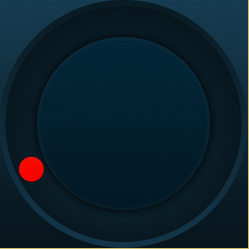
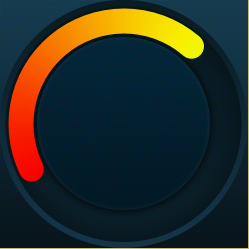
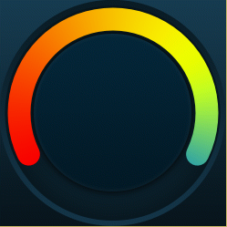

Purpose
========

  

The purpose of the CircularProgress widget is to provide an application developer with means presenting a progress indicator with nice gradient, circular graphics. For example purposes, the CircularProgress class also accepts touch events and will set the current progress to the calculated progress for the corresponding touch coordinates.

TouchGFX Version
=================

This widget was created and tested using TouchGFX version 4.2

Functional description
======================

The setup code is embedded in the constructor where the dimentsion of the circle arc is setup to match the bitmap used as background for the circular progress bar.

Ideas for new functionality could be the addition of move animation with a new value is set. This would require the registration of a tick evenet handler, an easing equation, and selecting how many steps to use for the transition.