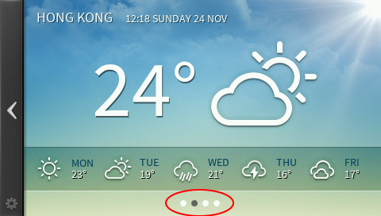

Purpose
========

The purpose of the DotIndicator is to provide an nice looking easy to use dot indication of the current displayed screen in a multi screen setup.

The DotIndicator class has a MAX_SIZE of 10. This number can be adjusted to whatever is needed.

TouchGFX Version
=================

This widget was created and tested using TouchGFX version 4.1.1

Functional description
======================

Setup the DotIndicator using the setNumberOfDots(), setBitmaps(), and setHighlightPosition() methods. After this use the goRight() and goLeft() methods to change the highlighted dot.
  
 

