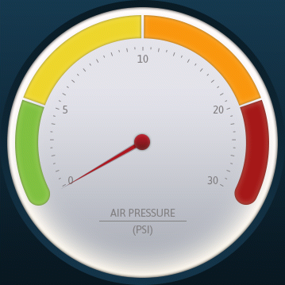
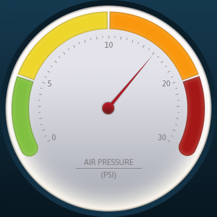

Purpose
========

 

The purpose of the Gauge widget is to provide an application developer with means of advancing and declining values in a circulare, graphical fashion. The application developer supplies a background image for the gauge as well as an image of the center of the gauge. Two such images can be seen below, as an exmaple, but they are not a part of the `LinearGauge` widget and it is purely up to the application developer to provide the graphics.

 

The widget supports a customizable easing equation for animating between set gauge-values. An animations length is determined by a configurable duration. A developer can ask the `LinearGauge` widget for the position of it's gauge level. The shape of the needle and the shadow of the needle is embedded inside the Gauge class and can be changed to suit the application

TouchGFX Version
=================

This widget was created and tested using TouchGFX version 4.2

Functional description
======================

The following exemplifies, in code, how to set up a Gauge widget. Once set up, the level of the gauge can be controlled by calling `setValue()`. Setting a value outside range of the configured minimum and maximum values will set the value to the limit.

    // Set the background and center bitmaps
    gauge.setBitmaps(Bitmap(BITMAP_GAUGE_BACKGROUND_ID), Bitmap(BITMAP_GAUGE_NEEDLE_PIN_ID));

    // Set the value range to 0-30 and the corresponding degrees to 240-480
    gauge.setLimits(0, 30, 240, 480);

    // Place the gauge on the screen
    gauge.setXY(100,85);

    // Set the formula for moving the needle
    gauge.setEasingEquation(EasingEquations::linearEaseNone);

    // Set the speed of the needle movement
    gauge.setAnimationDuration(20);

    // Set current value to 20
    gauge.setValue(20);

    // Add widget
    add(gauge);

