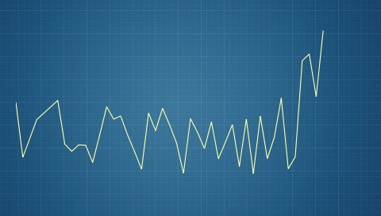

Purpose
========

The purpose of the Graph widget is to provide a simple interface for plotting connected points. X and Y ranges can be adjusted and the graph rescales automatically. 

The graph widget is hard coded to contain a maximum of 50 points. This number can easily be changed if needed.

The graph widget can be extended with more graph elements (like dots at each point in the graph). An example of this can be found in the TouchGFX distribution (app/demo/touchgfx_demo2015).

TouchGFX Version
=================

This widget was created and tested using TouchGFX version 4.3.0

Functional description
======================

An example showing setup and usage of the graph widget can be seen in the TemplateView.hpp and .cpp files. The image referenced can be found in the images folder. 
  
Please note that the graph widget uses the Canvas Widget Renderer which needs to be initialized. Code that does this can be found in the supplied target/main.cpp and simulator/main.cpp files. The size of the buffer can be adjusted. Read more on this in the documentation.

