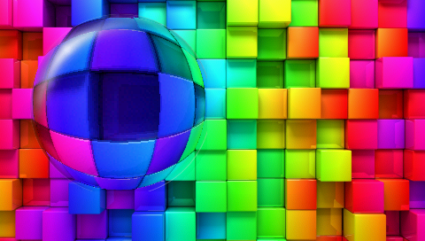
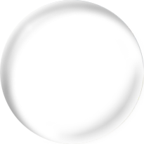

Purpose
========

The purpose of the Lens is to provide an effect on top of already existing graphics. The lens will distort the contents below it. 

The lens has a radius of 100. This number can be adjusted. Additional image data may be needed.

The lens adds an image of a semi transparent glass on top of the distorted graphics.

Note that the lens is more dependent on the contents of the framebuffer and therefore the order of drawing than more regular widgets.

TouchGFX Version
=================

This widget was created and tested using TouchGFX version 4.2.0

Functional description
======================

Add the lens to a view. 
  
 

