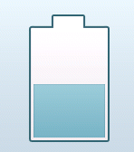

Purpose
========

   

The purpose of the LinearGauge widget is to provide an application developer with means of advancing and declining values in a linear, graphical fashion. Possible directions are: North, South, East, West. The application developer supplies a background image for the gauge as well as an image of the movable part of the gauge.

The widget supports a linear ease-in equation and for animating between set gauge-values. An animations length is determined by a configurable duration. A developer can ask the LinearGauge widget for the position of it's gauge level, in pixels, relative to it's parent container in an effort to provide a visible indicator that exists outside of the widgets container. One way of implementing this could be creating a further specialization, LinearGaugeWithIndicator.

TouchGFX Version
=================

This widget was tested using TouchGFX version 4.1.1

Functional description
======================

The following exemplifies, with code, how to set up a LinearGauge widget. Once set up, the levels can be controlled by calling stepPos(), stepNeg() which use the configured stepSize (default 1) or setGaugeLevel(level), where level is within the defined lower and upper bounds of the gauge.

    //Set the background - in this case an empty tank container, to be filled by movable content 
    gauge.setBackground(Bitmap(BITMAP_TANK_ID));

    //Add the content for the tank. Specify internal container offset (5,18), initial value (500), lower and upper bounds (200-1000) and the direction in which to advance/decline level of the gauge (VERTICAL_NORTH)
    gauge.setupGauge(Bitmap(BITMAP_TANK_CONTENT_ID), 5, 18, 500, 200, 1000, LinearGauge::VERTICAL_NORTH); 
  
    //Place the gauge on the screen
    gauge.setXY(100,85);   
  
    //Set step size  to 50. This is only relevant if using the stepPos() and stepNeg() methods to advance/decline levels. 
    gauge.setStepSize(50);

    //Enable animation between steps/values.
    gauge.enableAnimation(true); 
    
    //Add widgets
    add(gauge);
    
 

