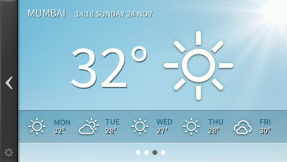
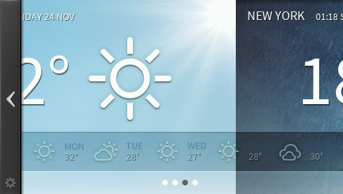

Purpose
========

The purpose of the SwipeContainer is to provide an easy way to add swipe functionality to a set of element. 

To use the SwipeContainer simply add equal sized graphical elements to the container and the swipe is ready to use.
The container will display dots to show which screen is showing. When a drag or swipe gesture has been performed 
the container will animate to the next element or snaps back to the shown element if a too small drag is performed.

Please note that the SwipeContainer uses the DotIndicator.cpp/hpp. This widget can also be found in the TouchGFX Open Widget Repository. This file is included in the SwipeContainer.hpp file and uses the path gui/common/DotIndicator.hpp. If you place the hpp file in a different location simply change the include path as well.

TouchGFX Version
=================

This widget was created and tested using TouchGFX version 4.1.1

Functional description
======================

Example:

in xxxView.hpp declare:

    SwipeContainer imageContainer;
    Image images[3];

in xxxView::setupScreen() do:

    images[0].setBitmap(Bitmap(BITMAP_IMAGE_00_ID));
    images[1].setBitmap(Bitmap(BITMAP_IMAGE_01_ID));
    images[2].setBitmap(Bitmap(BITMAP_IMAGE_02_ID));
    imageContainer.add(images[0]);
    imageContainer.add(images[1]);
    imageContainer.add(images[2]);
    imageContainer.setXY(0, 0);
    imageContainer.setDotIndicatorBitmaps(Bitmap(BITMAP_DOT_INDICATOR_ID), Bitmap(BITMAP_DOT_INDICATOR_HIGHLIGHTED_ID));
    imageContainer.setDotIndicatorXYWithCenteredX(imageContainer.getWidth()/2, imageContainer.getHeight() - 16);
    imageContainer.setSwipeCutoff(80);
    imageContainer.setEndSwipeElasticWidth(30);
    add(imageContainer);  
 
The two dot bitmaps can be found alongside the DotIndicator code in the TouchGFX Open Widget Repository. For the three BITMAP_IMAGE_0x_ID bitmaps use any equal sized bitmaps.